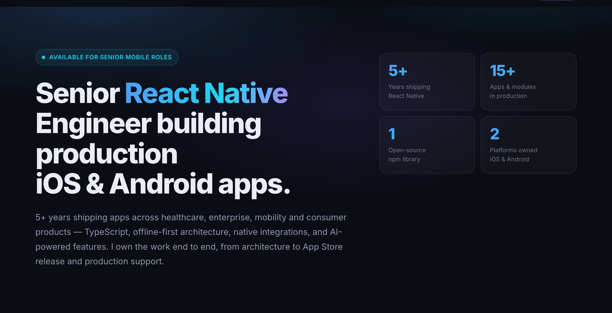
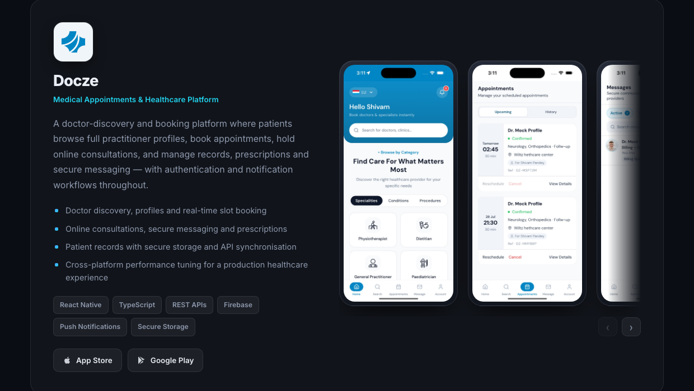

<div align="center">

# Shivam Pandey

**Senior React Native Engineer** · iOS &amp; Android · TypeScript · New Delhi, India

[](https://shivampandey-07.github.io/)
[](https://www.npmjs.com/package/react-native-agenda-kit)
[](https://linkedin.com/in/shivam-pandey07)

<a href="https://shivampandey-07.github.io/"></a>

### → [shivampandey-07.github.io](https://shivampandey-07.github.io/)

</div>

---

My portfolio. Five years of shipping production mobile apps across healthcare,
enterprise, mobility and consumer products — the four live ones are on the App
Store and Google Play, and you can download them right now.

## The build

No React. No Tailwind. No bundler, no `node_modules`, no CI step.

One HTML file, one stylesheet, one script — **1,103 lines total** — served straight
off `main` by GitHub Pages. The only thing the browser fetches from anywhere else
is the webfont. Nothing to install, nothing to break on a dependency bump, and the
site is still editable in five years by anyone who knows HTML.

That's the same instinct behind my npm library: the thing should do its job without
dragging a tree of dependencies along with it.

| | |
|---|---|
| **Markup** | 478 lines of semantic HTML, content inline |
| **Styles** | 458 lines of CSS — custom properties, grid, `scroll-snap` |
| **Script** | 167 lines of vanilla JS, no framework |
| **Runtime dependencies** | 0 |
| **Build step** | none |

## Things worth stealing

**The screenshots are real.** Every phone screen on the site is pulled from the
live App Store or Google Play listing of an app I actually shipped — fetched
through the iTunes Lookup API, not mocked up in Figma. If the store listing shows
it, the app does it.

<div align="center">
  
</div>

**Screenshot rails.** Horizontal `scroll-snap` carousels in CSS device frames, with
a fade mask on the overflow edge that lifts once you hit the end, plus a
click-to-zoom lightbox. Apps whose store shots already ship with a device frame get
a flat treatment instead, so you never see a frame inside a frame.

**Live npm stats.** The open-source section reads its version and monthly download
count straight from the npm registry on page load, with a static fallback if the
request fails. No stale numbers hardcoded into the markup.

**Motion that asks first.** Scroll reveals, hover lifts and smooth scrolling all
collapse to nothing under `prefers-reduced-motion`. Every image is lazy-loaded with
explicit dimensions, so nothing jumps while the page settles.

## Layout

```
index.html                 the whole page
assets/
  css/style.css            tokens, layout, responsive rules
  js/main.js               nav, reveals, rails, lightbox, npm stats
  shots/                   app screenshots (App Store / Google Play)
  icons/                   app icons
  lib/                     diagrams from react-native-agenda-kit
docs/                      images for this README
```

## Running it

```bash
python3 -m http.server 8080
# → http://localhost:8080
```

That's the whole toolchain. Edit `index.html`, refresh, push to `main` — Pages
redeploys in about a minute.

## What's on it

**Live apps** — Docze (healthcare booking), SRM (meditation and devotional media),
Pastoral Reach (congregational care), JOP (OKR and engagement), all four on both
stores.

**Open source** — [`react-native-agenda-kit`](https://www.npmjs.com/package/react-native-agenda-kit),
an expandable calendar, agenda and day-timeline for React Native. Declared row
heights and worklet-driven scroll sync, so layout measurement never happens during
a scroll. Zero runtime dependencies, MIT.

**Also built** — Starbucks Partner, myKFC, AMConnected, SOJO Rides, Panasonic
eCareWiz, and others.

## Get in touch

Open to senior React Native roles and interesting mobile problems.

[shivammpandey23@gmail.com](mailto:shivammpandey23@gmail.com) ·
[LinkedIn](https://linkedin.com/in/shivam-pandey07) ·
[GitHub](https://github.com/shivampandey-07)

---

<sub>App screenshots come from the public App Store and Google Play listings of
products I worked on. All trademarks belong to their respective owners.</sub>
